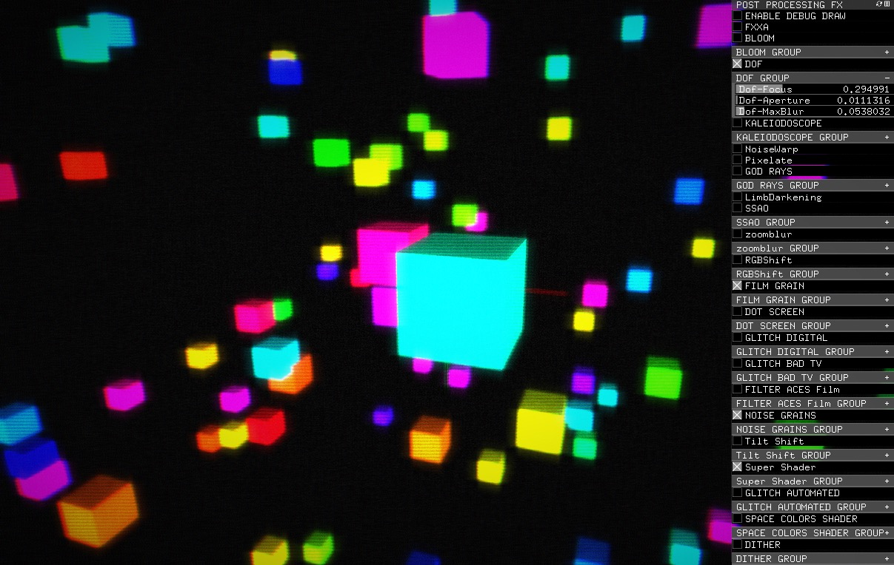

# ofxPostProcessing
I've added additional filter effects and manager gui to easily to adjust effect parameters.


------------------


This openFrameworks addon gives you an easy way of putting together a chain of GLSL post-processing effects.

www.neilmendoza.com/ofxpostprocessing

NB This addon uses the branch setup as OF itself, the stable branch corresponds to the most recent release (i.e. the version that is downloadable from the OF site) and the master branch is the develop branch. If you have downloaded from the website, the you will want to use the stable branch...

https://github.com/neilmendoza/ofxPostProcessing/tree/stable

## Features

At the moment, it comes with the following effects (some ported from other sources and some original) that I'll gradually add to over time:

* Bloom
* Convolution (Blur)
* Depth of field (with bokeh)
* Depth of field alternative (more features but heavier)
* Frei-Chen Edge Detector
* FXAA anti-aliasing
* Kaleidoscope
* Noise warp
* Pixelate
* SSAO
* Toon
* Godrays
* Tilt shift
* Fake subsurface scattering
* Many others, please see src directory

## Usage

In your OF app declare an instance of **ofxPostProcessing**...

```cpp
ofxPostProcessing post;
```

In your **setup()** function initialise the post-processing class and then add some effects...

```cpp
post.init(ofGetWidth(), ofGetHeight());
post.createPass<FxaaPass>();
post.createPass<BloomPass>();
```

Call **post.begin()** and **post.end()** around the the scene that you want to render...

```cpp
post.begin();
<RENDERING CODE>
post.end();
```

If you are using an **ofCamera** pass this to **post.begin()** and it takes care of the rest for you...

```cpp
post.begin(cam);
<RENDERING CODE>
post.end();
```

## TODO
* Add support for ofGLProgrammableRenderer with version 150 shaders
* More FX
* OpenGL ES, it's based around power of two textures so it should be fairly quick to get working. 
